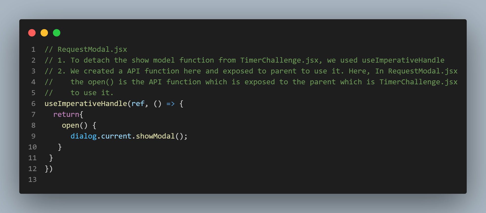

# About Project

This is a Timer challenge project where user need to stop the timer before the target time to win

This project is example of how to do following things:
- Accessing DOM elements using Refs
- How to forward the Refs if the react version is less than 19.
- Exposing the API functions from child components to parent components using useImperativeHandle

- Usage of useTimeout and useInterval functions and their uses.
- Usage of Portals

# React + Vite

This template provides a minimal setup to get React working in Vite with HMR and some ESLint rules.

Currently, two official plugins are available:

- [@vitejs/plugin-react](https://github.com/vitejs/vite-plugin-react/blob/main/packages/plugin-react/README.md) uses [Babel](https://babeljs.io/) for Fast Refresh
- [@vitejs/plugin-react-swc](https://github.com/vitejs/vite-plugin-react-swc) uses [SWC](https://swc.rs/) for Fast Refresh
